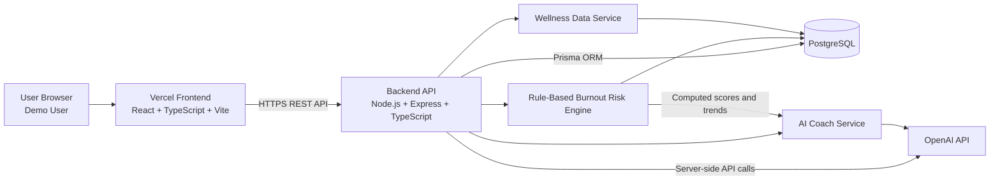
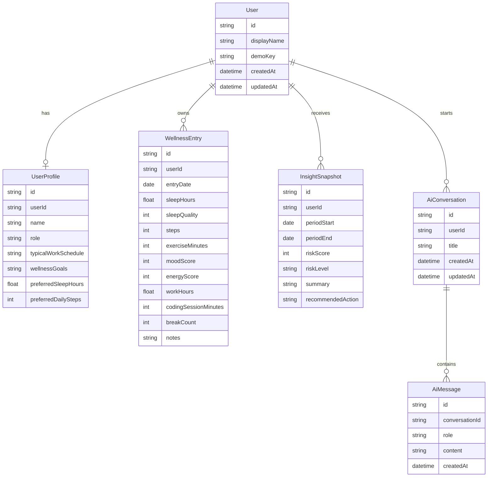
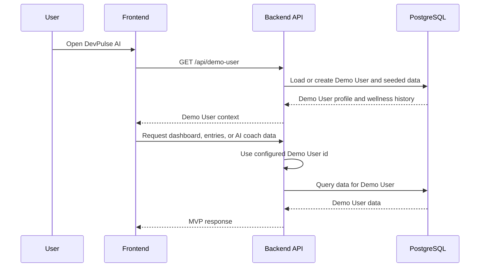
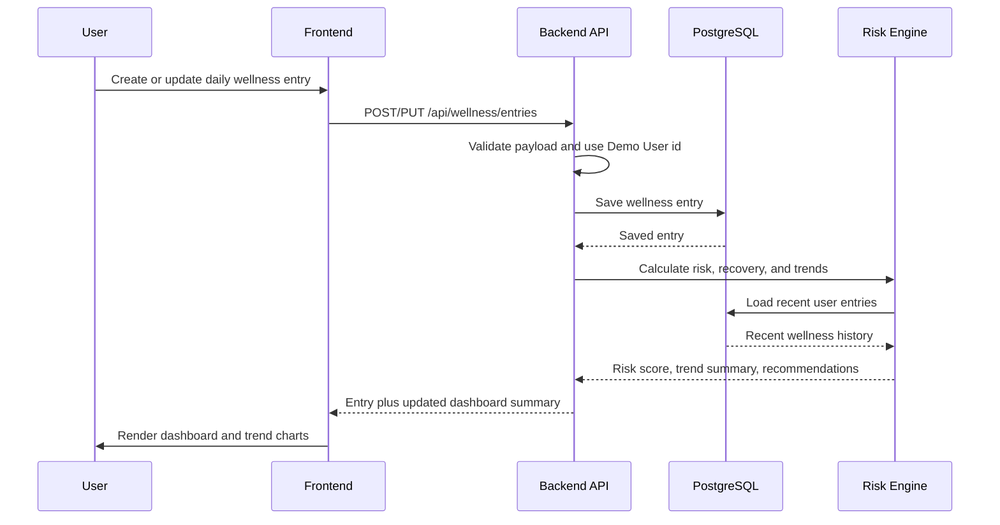
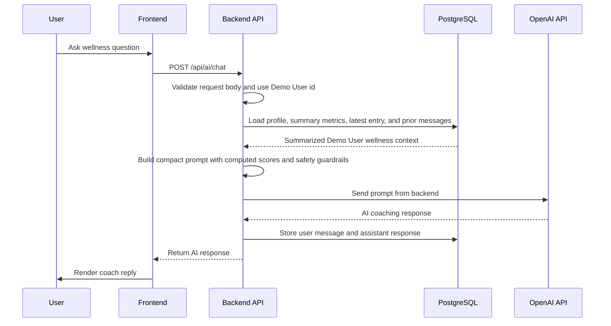
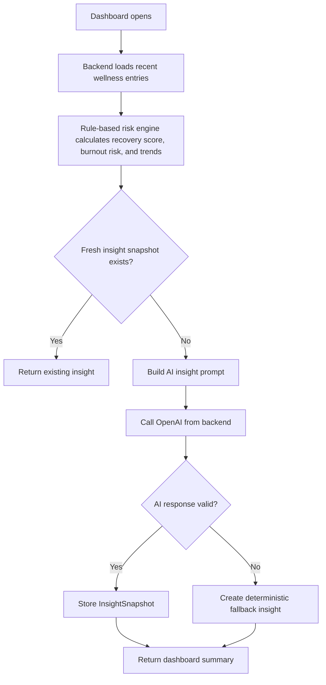
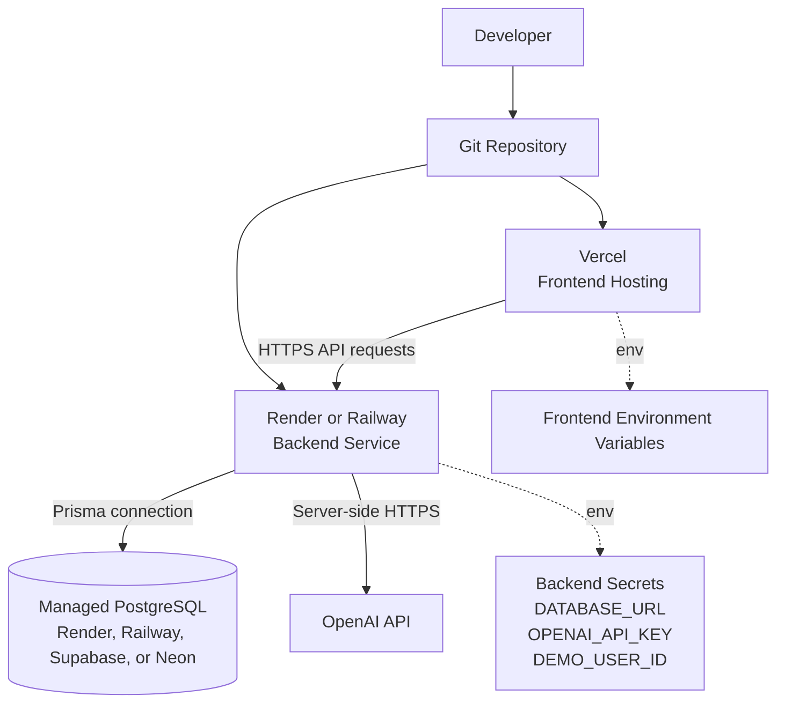

# DevPulse AI System Architecture

## System Overview

DevPulse AI is an AI-powered Developer Wellness Coach that helps developers understand burnout risk, recovery status, and wellness trends using sleep, activity, mood, and work-pattern data.

The MVP is a web application with a React frontend, Express backend, PostgreSQL database, Prisma ORM, a single Demo User experience, and OpenAI-powered coaching features. The architecture is intentionally lightweight so the hackathon MVP can be built quickly while still supporting future authentication and external integrations.

The MVP data sources are:

- Manual wellness entries
- Seeded demo data

External integrations such as Google Health Connect, Apple Health, Fitbit, GitHub, Calendar, IDE plugins, and notifications are future enhancements and are not part of the MVP.

## Architecture Principles

- **Privacy first:** Health and wellness data is sensitive. The MVP uses a Demo User for speed, and future authentication must scope all data to the authenticated user.
- **Backend-owned AI access:** OpenAI API keys and prompt assembly live only on the backend.
- **Explain, do not diagnose:** AI responses provide coaching, trend explanations, and recommendations, not medical diagnosis.
- **Simple MVP, extensible boundaries:** Use REST APIs and modular services before introducing event queues or microservices.
- **Deterministic scoring:** Burnout risk, recovery score, and trend summaries are generated from stored user data using predefined backend rules. AI explains these outputs but does not calculate them.
- **Graceful degradation:** The dashboard remains usable if AI generation fails.

## High-Level Architecture



### Runtime Components

- **Frontend:** User interface for the Demo User experience, dashboard, wellness entry management, and AI coach chat.
- **Backend API:** REST API that handles Demo User data access, deterministic risk scoring, trend aggregation, recommendations, and AI calls.
- **PostgreSQL:** Persistent storage for users, profiles, wellness entries, AI conversations, AI messages, and insight snapshots.
- **OpenAI API:** External AI provider used by the backend to generate explanations, summaries, and recommendations.

## Frontend Architecture

The frontend should be implemented as a React + TypeScript + Vite application styled with Tailwind CSS.

### Responsibilities

- Provide a fast Demo User flow:
  - Load seeded demo data without registration or login
  - Allow manual entry creation and editing against the Demo User
  - Make the dashboard useful immediately for judges and first-time users
- Collect onboarding and profile preferences:
  - Role
  - Typical work schedule
  - Wellness goals
  - Preferred sleep and activity targets
- Manage wellness entries:
  - Create daily entry
  - View historical entries
  - Edit entries
  - Delete entries
- Render dashboard views:
  - Burnout risk score
  - Risk level
  - Sleep summary
  - Activity summary
  - Workload summary
  - Recovery status
  - Trend charts
  - AI-generated daily insight
  - Recommended action
- Provide AI coach chat:
  - User question input
  - Conversation history
  - Loading states
  - AI failure fallback states
  - Non-medical disclaimer

### Frontend Layers

- **Pages:** Route-level screens such as dashboard, onboarding/profile, entries, and AI coach.
- **Components:** Reusable UI pieces such as cards, forms, charts, metric tiles, risk badges, and chat messages.
- **API client:** Typed wrapper around backend REST endpoints.
- **State management:** Local React state for forms and UI state; server state can be handled with a lightweight query library or a local API abstraction.
- **Demo user state:** Stores the active Demo User context for the hackathon MVP.

### Future Authentication Guidance

Authentication is intentionally excluded from the hackathon MVP to reduce implementation time and focus the demo on wellness insights, risk scoring, and AI coaching.

In a future iteration, add registration, login, password hashing, protected routes, and either an HTTP-only secure cookie session or a short-lived access token plus refresh-token flow.

## Backend Architecture

The backend should be implemented as a Node.js + Express + TypeScript REST API.

### Responsibilities

- Use a known Demo User record for all MVP data.
- Validate API request payloads.
- Manage wellness entries.
- Calculate recovery score, burnout risk, and trend summaries with deterministic predefined rules.
- Generate deterministic recommendations where possible.
- Prepare minimal AI context from summarized Demo User data.
- Call OpenAI server-side.
- Store AI conversation history and insight snapshots.
- Return safe fallback responses when AI calls fail.

### Lightweight Backend Structure

For hackathon speed, the backend should use a simple layered structure instead of many feature-specific modules:

- **controllers:** Parse requests and return responses.
- **routes:** Register REST routes and connect them to controllers.
- **services:** Hold business logic for wellness entries, dashboard summaries, risk scoring, recommendations, and AI coaching.
- **middleware:** Handle request logging, errors, validation, CORS, and future auth.
- **prisma:** Hold the Prisma schema, migrations, seed script, and database client.
- **utils:** Shared helpers such as date calculations, score mapping, and prompt formatting.
- **types:** Backend TypeScript types and API response shapes.

This keeps the MVP easier to build while preserving clean boundaries. If the app grows, services can later be split into feature modules without changing the product behavior.

### Burnout Risk Engine

The Burnout Risk Engine is deterministic and rule-based. It should calculate recovery score, burnout risk score, risk level, and trend indicators from predefined backend rules using wellness metrics such as sleep, activity, mood, energy, work hours, coding duration, and breaks.

OpenAI must not calculate the risk score. AI should only explain the backend-calculated results, generate coaching insights, and answer questions using the summarized metrics and computed scores.

### Suggested REST API Surface

The exact endpoint names can evolve during implementation, but the MVP should expose this shape:

- `GET /api/demo-user`
- `PUT /api/demo-user/profile`
- `GET /api/wellness/entries`
- `POST /api/wellness/entries`
- `GET /api/wellness/entries/:id`
- `PUT /api/wellness/entries/:id`
- `DELETE /api/wellness/entries/:id`
- `GET /api/dashboard/summary`
- `GET /api/insights/daily`
- `POST /api/ai/chat`
- `GET /api/ai/conversations/:id`

## Database Architecture

PostgreSQL is the source of truth. Prisma should manage the schema, migrations, and type-safe database access.

### Core Entities

#### `User`

Stores the Demo User record for the MVP. In a future authenticated product, this entity can evolve into a real account model.

Key fields:

- `id`
- `displayName`
- `demoKey`
- `createdAt`
- `updatedAt`

#### `UserProfile`

Stores user preferences and wellness goals.

Key fields:

- `id`
- `userId`
- `name`
- `role`
- `typicalWorkSchedule`
- `wellnessGoals`
- `preferredSleepHours`
- `preferredDailySteps`
- `createdAt`
- `updatedAt`

#### `WellnessEntry`

Stores daily user-entered wellness and work-pattern data.

Key fields:

- `id`
- `userId`
- `entryDate`
- `sleepHours`
- `sleepQuality`
- `steps`
- `exerciseMinutes`
- `moodScore`
- `energyScore`
- `workHours`
- `codingSessionMinutes`
- `breakCount`
- `notes`
- `createdAt`
- `updatedAt`

#### `InsightSnapshot`

Stores generated daily or weekly insight summaries so the app can avoid unnecessary AI regeneration and show historical insights.

Key fields:

- `id`
- `userId`
- `periodStart`
- `periodEnd`
- `riskScore`
- `riskLevel`
- `summary`
- `recommendedAction`
- `createdAt`

#### `AiConversation`

Groups AI coach messages.

Key fields:

- `id`
- `userId`
- `title`
- `createdAt`
- `updatedAt`

#### `AiMessage`

Stores user and assistant messages for AI coach history.

Key fields:

- `id`
- `conversationId`
- `role`
- `content`
- `createdAt`

### Future-Ready Entities

These entities should be considered extension points and are not required for the MVP:

- `IntegrationAccount`: Stores linked external accounts such as wearable, GitHub, or calendar providers.
- `ImportedMetric`: Stores normalized metrics imported from external integrations.
- `Recommendation`: Stores structured recommendations and user engagement state.

### Data Relationship Diagram



## AI Integration Architecture

OpenAI integration must happen only from the backend. The frontend never receives or stores the OpenAI API key.

### AI Responsibilities

- Explain recent wellness trends in plain language.
- Summarize 7-day wellness patterns.
- Answer user questions about their own stored data.
- Generate practical recovery and habit recommendations.
- Reframe concerning trends safely without medical diagnosis.
- Explain backend-calculated recovery score and burnout risk without recalculating or overriding them.

### AI Context Strategy

The backend should avoid sending raw historical records whenever possible. It should build a compact context package from summarized metrics to improve privacy, latency, and API cost.

The AI context should contain:

- User role and wellness goals
- Sleep, activity, workload, mood, and energy averages
- Recent trend direction for each major metric
- Current burnout risk score and risk level
- Current recovery score
- Latest wellness entry highlights
- Rule-based recommendation candidates
- Safety instruction that the response is wellness coaching, not medical advice

Raw historical entries should only be included when a specific user question requires them, and even then the backend should include the smallest relevant window.

### AI Safety Requirements

AI responses must:

- Avoid diagnosis or treatment claims.
- Use cautious language for health-related concerns.
- Encourage professional help for serious or persistent symptoms.
- Provide practical, low-risk suggestions.
- Explain uncertainty when data is incomplete.

### AI Failure Behavior

If OpenAI is unavailable, times out, or returns an invalid response, the backend should:

- Log the failure server-side.
- Return a safe fallback message.
- Preserve the rest of the dashboard experience.
- Avoid exposing provider error details to the user.

## Demo User Flow



### Future Authentication

Registration, login, JWT or cookie sessions, password hashing, and protected routes are intentionally out of scope for the hackathon MVP. They should be added in a future iteration before handling real multi-user data.

When authentication is added, every user-owned query must be scoped by authenticated `userId`, and users must not be able to read, update, or delete another user's wellness data, insights, or AI messages.

## Core Data Flows

### Wellness Entry and Dashboard Flow



### AI Coach Flow



### Daily Insight Generation Flow



## Suggested Folder Structure

The target project should use a simple structure optimized for rapid hackathon development:

```text
DevPulse-AI/
  frontend/
    src/
      api/
      components/
      features/
        dashboard/
        wellness/
        ai-coach/
        profile/
      hooks/
      pages/
      styles/
      types/
    public/
  backend/
    prisma/
      schema.prisma
      seed.ts
    src/
      controllers/
      middleware/
      routes/
      services/
      types/
      utils/
      server.ts
  docs/
    PRD.md
    ARCHITECTURE.md
  README.md
```

### Folder Responsibilities

- `frontend`: Browser application and user experience.
- `backend`: REST API, deterministic scoring, Prisma, and OpenAI integration.
- `docs`: Product, architecture, and planning documentation.

This structure is intentionally flatter than a full monorepo. It reduces setup overhead, keeps paths easy to understand during the hackathon, and remains clean enough to scale into a monorepo later if shared packages become valuable.

## Deployment Architecture



### Deployment Responsibilities

- **Vercel:** Hosts the frontend static application and manages frontend environment variables.
- **Render or Railway:** Runs the backend Express service.
- **Managed PostgreSQL:** Stores production application data.
- **OpenAI API:** Provides AI-generated coaching responses.
- **Environment variables:** Store deployment-specific configuration and secrets.

### Required Backend Environment Variables

- `DATABASE_URL`
- `OPENAI_API_KEY`
- `DEMO_USER_ID`
- `FRONTEND_URL`
- `NODE_ENV`

### Required Frontend Environment Variables

- `VITE_API_BASE_URL`

## Security, Privacy, and Safety Considerations

### Security

- Keep OpenAI API keys and database credentials out of source control.
- Validate request payloads before processing.
- Rate-limit AI endpoints.
- Use HTTPS in deployed environments.
- Configure CORS to allow only trusted frontend origins.
- Do not treat the Demo User approach as production-ready multi-user security.

### Privacy

- Treat wellness data as sensitive user data.
- Do not collect code content, keystrokes, private repository contents, or screen activity in the MVP.
- Send only minimal, relevant summarized metrics to OpenAI.
- Avoid logging full AI prompts if they contain sensitive user data.
- Provide clear user-facing messaging that DevPulse AI is not a medical product.

### AI Safety

- AI responses must not diagnose medical conditions.
- AI responses should focus on patterns, recovery habits, and low-risk suggestions.
- Serious or persistent health concerns should be directed to qualified professionals.
- Incomplete data should be acknowledged instead of overinterpreted.

## Scalability and Future Extensions

### Near-Term Extensions

- Add registration, login, password hashing, protected routes, and secure session handling.
- Add background jobs for scheduled insight generation.
- Add dashboard caching for summary endpoints.
- Store structured recommendation engagement events.
- Add automated tests around risk scoring and AI prompt construction.

### Future Integrations

- **Wearables and health platforms:** Google Health Connect, Apple Health, Fitbit, Garmin.
- **Developer activity:** GitHub contribution metadata, pull request cadence, issue workload.
- **Calendar:** Meeting load, late meetings, focus block availability.
- **IDE plugins:** Voluntary coding session summaries without collecting code content.
- **Notifications:** Email, Slack, Discord, or push reminders for recovery actions.

### Scaling Path

The MVP should begin as a modular monolith. If usage grows, the system can evolve by separating:

- AI generation into a background worker.
- Integration ingestion into scheduled jobs.
- Analytics aggregation into materialized views or cached summaries.
- Notification delivery into an asynchronous queue.

These changes should preserve the core contract: user data is scoped to the correct user once authentication exists, AI access remains backend-owned, deterministic backend rules calculate risk scores, and health outputs remain coaching-oriented rather than diagnostic.
