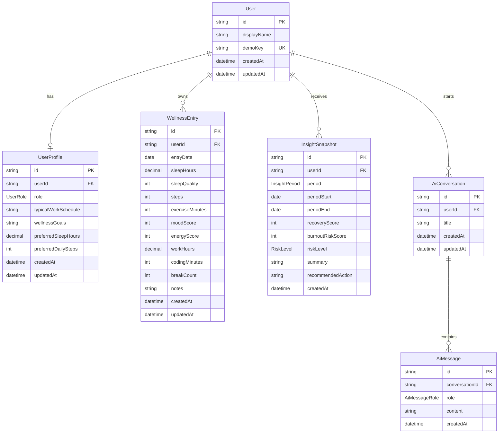

# DevPulse AI Database Design

## Overview

DevPulse AI uses PostgreSQL with Prisma for the hackathon MVP. The schema is intentionally small: it supports a Demo User, profile preferences, manual wellness entries, deterministic score snapshots, and AI coach conversation history.

The MVP does not include authentication or external integrations. It relies on:

- A seeded Demo User
- Manual wellness entries
- Seeded demo wellness history
- Backend-calculated recovery and burnout risk scores
- OpenAI-generated explanations and coaching responses

The database stores source data and useful historical AI outputs. It should not store values that are cheap, deterministic, and safer to recalculate on request.

## Design Goals

- Keep the schema easy to implement during a hackathon.
- Preserve clean relationships for future authenticated users.
- Store only data needed for the dashboard, AI coach, and demo.
- Avoid premature integration-specific tables.
- Keep scoring deterministic in backend services, not in AI prompts.
- Use Prisma conventions that produce readable TypeScript client APIs.

## Mermaid ER Diagram

## Enums

### `UserRole`

Represents the developer persona for personalization and AI context.

Values:

- `SOFTWARE_ENGINEER`
- `STUDENT`
- `COMPETITIVE_PROGRAMMER`
- `REMOTE_DEVELOPER`
- `FOUNDER`
- `FREELANCER`
- `OTHER`

### `RiskLevel`

Represents the backend-calculated burnout risk category.

Values:

- `LOW`
- `MODERATE`
- `HIGH`
- `CRITICAL`

### `InsightPeriod`

Represents the time window summarized by an insight snapshot.

Values:

- `DAILY`
- `WEEKLY`

### `AiMessageRole`

Represents the speaker in an AI coach conversation.

Values:

- `USER`
- `ASSISTANT`
- `SYSTEM`

For the MVP, persisted chat history will usually use only `USER` and `ASSISTANT`. `SYSTEM` is available if developers decide to store generated system-context messages for debugging, but sensitive prompts should generally not be stored.

## Tables

## `User`

### Why It Exists

`User` stores the seeded Demo User for the hackathon MVP. Even without authentication, keeping a user table makes the schema easy to upgrade later when real accounts are added.

### Columns

| Column | Prisma Type | PostgreSQL Type | Required | Notes |
| --- | --- | --- | --- | --- |
| `id` | `String` | `text` or `uuid` | Yes | Primary key. Use UUID-style IDs through Prisma. |
| `displayName` | `String` | `text` | Yes | Demo user display name. |
| `demoKey` | `String` | `text` | Yes | Stable unique key such as `default-demo-user`. |
| `createdAt` | `DateTime` | `timestamp` | Yes | Defaults to current timestamp. |
| `updatedAt` | `DateTime` | `timestamp` | Yes | Automatically updated by Prisma. |

### Relationships

- One `User` has one optional `UserProfile`.
- One `User` has many `WellnessEntry` records.
- One `User` has many `InsightSnapshot` records.
- One `User` has many `AiConversation` records.

### Indexes and Constraints

- Primary key on `id`.
- Unique constraint on `demoKey`.

## `UserProfile`

### Why It Exists

`UserProfile` stores preference and personalization data used by the dashboard, risk engine, and AI coach. Keeping this separate from `User` avoids mixing account identity with wellness preferences.

### Columns

| Column | Prisma Type | PostgreSQL Type | Required | Notes |
| --- | --- | --- | --- | --- |
| `id` | `String` | `text` or `uuid` | Yes | Primary key. |
| `userId` | `String` | `text` or `uuid` | Yes | Foreign key to `User.id`. |
| `role` | `UserRole` | `enum` | Yes | Used for personalized explanations. |
| `typicalWorkSchedule` | `String?` | `text` | No | Free-form schedule summary. |
| `wellnessGoals` | `String?` | `text` | No | Free-form goals for MVP speed. |
| `preferredSleepHours` | `Decimal?` | `numeric(4,2)` | No | Example: `7.50`. |
| `preferredDailySteps` | `Int?` | `integer` | No | Example: `8000`. |
| `createdAt` | `DateTime` | `timestamp` | Yes | Defaults to current timestamp. |
| `updatedAt` | `DateTime` | `timestamp` | Yes | Automatically updated by Prisma. |

### Relationships

- Belongs to one `User`.

### Indexes and Constraints

- Primary key on `id`.
- Unique constraint on `userId` so each user has at most one profile.
- Foreign key from `userId` to `User.id` with cascade delete.
- Optional check constraints can be added later for targets, but application-level validation is enough for the MVP.

## `WellnessEntry`

### Why It Exists

`WellnessEntry` is the main source table for the product. It stores daily manual health, recovery, and work-pattern inputs. The dashboard, risk engine, trend summaries, and AI context are derived from this table.

### Columns

| Column | Prisma Type | PostgreSQL Type | Required | Notes |
| --- | --- | --- | --- | --- |
| `id` | `String` | `text` or `uuid` | Yes | Primary key. |
| `userId` | `String` | `text` or `uuid` | Yes | Foreign key to `User.id`. |
| `entryDate` | `DateTime` | `date` | Yes | The local date represented by the entry. |
| `sleepHours` | `Decimal?` | `numeric(4,2)` | No | Sleep duration in hours. |
| `sleepQuality` | `Int?` | `smallint` | No | Recommended range: 1-5. |
| `steps` | `Int?` | `integer` | No | Manual step count or approximate activity count. |
| `exerciseMinutes` | `Int?` | `integer` | No | Total exercise or intentional movement. |
| `moodScore` | `Int?` | `smallint` | No | Recommended range: 1-5. |
| `energyScore` | `Int?` | `smallint` | No | Recommended range: 1-5. |
| `workHours` | `Decimal?` | `numeric(4,2)` | No | Total work or study hours. |
| `codingMinutes` | `Int?` | `integer` | No | Total focused coding minutes for the day. |
| `breakCount` | `Int?` | `integer` | No | Number of meaningful breaks. |
| `notes` | `String?` | `text` | No | Optional user note. Do not send notes to AI by default. |
| `createdAt` | `DateTime` | `timestamp` | Yes | Defaults to current timestamp. |
| `updatedAt` | `DateTime` | `timestamp` | Yes | Automatically updated by Prisma. |

### Relationships

- Belongs to one `User`.

### Indexes and Constraints

- Primary key on `id`.
- Foreign key from `userId` to `User.id` with cascade delete.
- Composite unique constraint on `userId` and `entryDate` to enforce one entry per user per day.
- Composite index on `userId` and `entryDate` descending for dashboard and trend queries.
- Application-level validation should enforce:
  - `sleepHours` between 0 and 24
  - `sleepQuality`, `moodScore`, and `energyScore` between 1 and 5
  - `steps`, `exerciseMinutes`, `codingSessionMinutes`, and `breakCount` are non-negative
  - `workHours` between 0 and 24

## `InsightSnapshot`

### Why It Exists

`InsightSnapshot` stores generated daily or weekly insight text and the backend-calculated scores used at generation time. This gives the demo stable AI outputs, reduces repeated OpenAI calls, and allows the UI to show previous insights.

This table should not be the source of truth for current risk. Current dashboard scores should be recalculated from `WellnessEntry` data.

### Columns

| Column | Prisma Type | PostgreSQL Type | Required | Notes |
| --- | --- | --- | --- | --- |
| `id` | `String` | `text` or `uuid` | Yes | Primary key. |
| `userId` | `String` | `text` or `uuid` | Yes | Foreign key to `User.id`. |
| `period` | `InsightPeriod` | `enum` | Yes | `DAILY` or `WEEKLY`. |
| `periodStart` | `DateTime` | `date` | Yes | Start date of summarized period. |
| `periodEnd` | `DateTime` | `date` | Yes | End date of summarized period. |
| `recoveryScore` | `Int` | `smallint` | Yes | Backend-calculated score at generation time. |
| `burnoutRiskScore` | `Int` | `smallint` | Yes | Backend-calculated score at generation time. |
| `riskLevel` | `RiskLevel` | `enum` | Yes | Backend-calculated category. |
| `summary` | `String` | `text` | Yes | AI-generated or fallback summary. |
| `recommendedAction` | `String` | `text` | Yes | AI-generated or rule-based recommendation. |
| `createdAt` | `DateTime` | `timestamp` | Yes | Defaults to current timestamp. |

### Relationships

- Belongs to one `User`.

### Indexes and Constraints

- Primary key on `id`.
- Foreign key from `userId` to `User.id` with cascade delete.
- Composite index on `userId`, `period`, and `periodStart`.
- Optional unique constraint on `userId`, `period`, `periodStart`, and `periodEnd` if the MVP should reuse one snapshot per period.
- Application-level validation should enforce scores between 0 and 100.

## `AiConversation`

### Why It Exists

`AiConversation` groups AI coach messages so the UI can show a simple conversation history. This is useful for the hackathon demo because judges can see contextual follow-up questions.

### Columns

| Column | Prisma Type | PostgreSQL Type | Required | Notes |
| --- | --- | --- | --- | --- |
| `id` | `String` | `text` or `uuid` | Yes | Primary key. |
| `userId` | `String` | `text` or `uuid` | Yes | Foreign key to `User.id`. |
| `title` | `String?` | `text` | No | Optional generated or static title. |
| `createdAt` | `DateTime` | `timestamp` | Yes | Defaults to current timestamp. |
| `updatedAt` | `DateTime` | `timestamp` | Yes | Automatically updated by Prisma. |

### Relationships

- Belongs to one `User`.
- Has many `AiMessage` records.

### Indexes and Constraints

- Primary key on `id`.
- Foreign key from `userId` to `User.id` with cascade delete.
- Index on `userId` and `updatedAt` descending for conversation lists.

## `AiMessage`

### Why It Exists

`AiMessage` stores the user and assistant turns in the AI coach. It allows the backend to provide short-term conversational context without relying only on frontend state.

### Columns

| Column | Prisma Type | PostgreSQL Type | Required | Notes |
| --- | --- | --- | --- | --- |
| `id` | `String` | `text` or `uuid` | Yes | Primary key. |
| `conversationId` | `String` | `text` or `uuid` | Yes | Foreign key to `AiConversation.id`. |
| `role` | `AiMessageRole` | `enum` | Yes | `USER`, `ASSISTANT`, or rarely `SYSTEM`. |
| `content` | `String` | `text` | Yes | Message text. |
| `createdAt` | `DateTime` | `timestamp` | Yes | Defaults to current timestamp. |

### Relationships

- Belongs to one `AiConversation`.

### Indexes and Constraints

- Primary key on `id`.
- Foreign key from `conversationId` to `AiConversation.id` with cascade delete.
- Index on `conversationId` and `createdAt` ascending for message history.

## Recommended Computed Fields

The following values should not be stored as primary source-of-truth fields in the MVP. They should be calculated dynamically in backend services from `WellnessEntry` and profile data.

- Current recovery score
- Current burnout risk score
- Current risk level
- Sleep average over 7 or 30 days
- Work-hour average over 7 or 30 days
- Activity average over 7 or 30 days
- Mood and energy averages
- Sleep consistency
- Recovery trend over the past 7 days
- Workload trend direction
- Activity trend direction
- Burnout risk trend direction
- Dashboard summary cards
- Rule-based recommendation candidates

`InsightSnapshot` may store the score values used when an insight was generated, but that is historical context, not the live source of truth.

## Future Integration Support

External integrations are not part of the MVP. The MVP schema should not add provider-specific tables yet.

The current schema supports future integrations because:

- `User` can evolve from Demo User to authenticated account owner.
- `WellnessEntry` already represents normalized daily wellness data, regardless of whether values came from manual entry or an external provider.
- `UserProfile` can hold user preferences that guide integration-based recommendations.
- `InsightSnapshot` can summarize manually entered or imported metrics without changing the AI layer.

When integrations are added, introduce separate ingestion tables rather than overloading `WellnessEntry`: This preserves raw provider data while keeping the application independent of any specific wearable vendor.

- `IntegrationAccount` for connected providers such as Google Health Connect, Apple Health, Fitbit, GitHub, or Calendar.
- `ImportedMetric` for raw or normalized provider metrics.
- `MetricSource` or `DataSource` enum to distinguish manual, seeded, wearable, GitHub, and calendar data.

After ingestion, the backend can aggregate provider data into the same dashboard summaries used by the MVP. This keeps the MVP simple while preserving a clear path to richer data.

## Prisma Design Recommendations

### Naming Conventions

- Use PascalCase model names: `User`, `WellnessEntry`, `InsightSnapshot`.
- Use camelCase field names: `createdAt`, `entryDate`, `burnoutRiskScore`.
- Use singular model names even when tables contain many rows.
- Use explicit enum names: `RiskLevel`, `InsightPeriod`, `AiMessageRole`.
- Keep relation field names readable: `user`, `profile`, `wellnessEntries`, `messages`.

### IDs and Dates

- Use string IDs with generated UUIDs for all primary keys.
- Use `createdAt` on every table.
- Use `updatedAt` on mutable tables.
- Use `entryDate`, `periodStart`, and `periodEnd` as date-only values conceptually, even if Prisma maps them through `DateTime`.
- Keep all stored timestamps in UTC.

### Decimal Values

- Use Prisma `Decimal` for hour values such as `sleepHours`, `workHours`, and `preferredSleepHours`.
- Convert decimals carefully at the API boundary so the frontend receives predictable numbers.

### Relations and Deletes

- Use cascade delete from `User` to dependent Demo User data.
- Use cascade delete from `AiConversation` to `AiMessage`.
- Always query child records through the known Demo User for the MVP.
- When authentication is added later, replace Demo User lookups with authenticated `userId` scoping.

### Validation

Prisma constraints should handle identity, uniqueness, and relationships. Business validation should live in backend services or request validation middleware.

Recommended application validations:

- Score inputs use the selected UI scale consistently.
- Date inputs cannot create duplicate entries for the same user and day.
- Numeric metrics cannot be negative.
- Health notes should be optional and length-limited.
- AI message content should be length-limited before storage and before sending to OpenAI.

## Implementation Notes for Developers

- Seed exactly one Demo User for the MVP and reference it through `DEMO_USER_ID` or a stable `demoKey`.
- Seed at least 14 days of wellness entries so trend charts and AI summaries look meaningful.
- Keep all seeded data realistic and internally consistent (for example, lower sleep should generally correspond to lower recovery scores) so the demo tells a believable story.
- Keep the risk engine in backend service code, not in the database and not in OpenAI prompts.
- Use `WellnessEntry` as the only MVP source table for user metrics.
- Recalculate dashboard scores dynamically from recent entries.
- Store `InsightSnapshot` only when a generated insight should be reused or displayed historically.
- Send summarized metrics to OpenAI instead of raw full history whenever possible.
- Do not store OpenAI API keys, prompts with sensitive details, or provider secrets in the database.
- Add real authentication only after the MVP demo flow is stable.
- Add integration tables only when the first external data provider is implemented.
